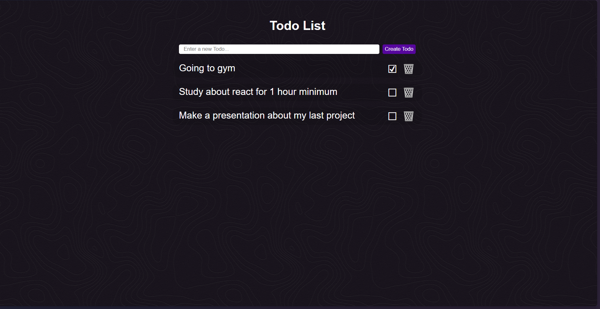

# Todo List

A simple and efficient Todo List application using MERN stack

## Table of contents
- [Overview](#overview)
- [Features](#features)
- [Installation](#installation)
- [Usage](#usage)
- [Technologies](#technologies)

## Overview
This project is a full-stack Todo List application where users can add, delete, and mark tasks



## Features
- Create new todos
- Mark todos as completed
- Delete todos
- Real time updates to database

## Installation

1. **Clone the repository**
```bash
git clone https://github.com/aldoLorenzio/todo-mern.git
```

2. **Install backend depedencies**
```bash
cd server
npm install
```

3. **Install frontend depedencies**
```bash
cd ../client
npm install
```

4. **Set up environment variables:**
   - Create a `.env` file in the `backend` directory and add the following variables:
     ```env
     MONGO_URI=your_mongo_database_uri
     PORT=5000
     ```

5. **Run the backend server**
```bash
cd ../server
npm install
```

6. **Run the frontend server**
```bash
cd ../client
npm install
```

7. Open your browser and navigate to `http://localhost:3000` to see the app in action

## Usage
- To add a new todo, enter the task in the input field and click "Add Todo".
- To mark a todo as completed, click on the checkbox next to the task.
- To delete a todo, click on the delete icon next to the task.


## Technologies

- **MongoDB:** Database
- **Express:** Backend framework
- **React:** Frontend library
- **Node.js:** JavaScript runtime

---

Thank you for checking out my Todo List app! Happy task managing!